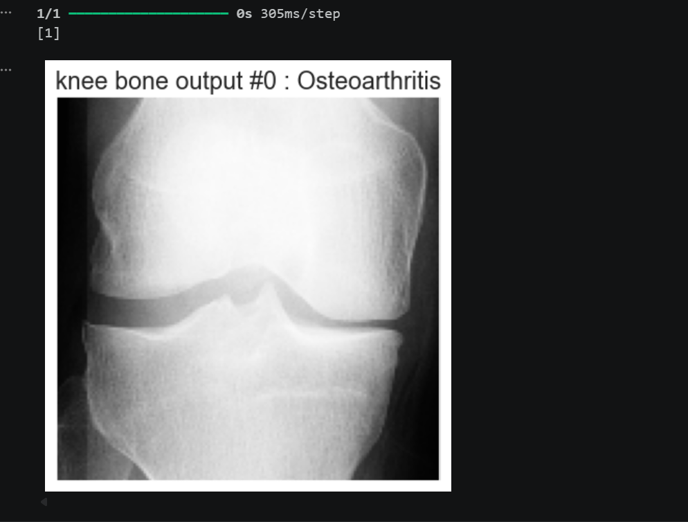

# Knee Osteoarthritis Detection using Deep Learning

[License: MIT](https://shields.io),
[Python](https://shields.io),
[Deep Learning](https://shields.io)

## 📋 Project Overview
Early detection of Knee Osteoarthritis (KOA) is critical for effective patient management. This project leverages **Computer Vision** and **Deep Learning** to build an automated diagnostic tool. The system classifies knee X-ray images into two categories: **Normal** and **Osteoarthritis**, providing a reliable "second opinion" for medical practitioners.

## 🚀 Key Features
*   **Binary Classification:** Accurately distinguishes between healthy joints and OA affected knees.
*   **Medical Image Processing:** Implements custom preprocessing pipelines for X-ray normalization.
*   **End-to-End Pipeline:** Covers everything from data loading and augmentation to model evaluation.
*   **Visual Results:** Integrated performance metrics and prediction visualizations.

## 🛠️ Tech Stack
*   **Language:** Python
*   **Libraries:** TensorFlow, Keras, NumPy, OpenCV, Matplotlib
*   **Environment:** Jupyter Notebook / Google Colab

## 📊 Model Performance

*Include a brief summary of your results here, for example:*
- **Accuracy:** ~90% on test data.
- **Key Metric:** Focused on high **Recall** to ensure no potential cases are missed.

## 📁 Project Structure
```text
├── datasets/           # Training and Testing data folders
├── main.ipynb          # Implementation of the CNN model
├── Result.png          # Visual proof of model accuracy
├── LICENSE             # MIT License
└── README.md           # Documentation

